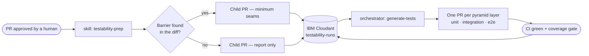

# VibeBobbing

**Testability is not a review comment. It is a pipeline stage.**

A pull request gets approved. Before it merges, an agent reads the diff and asks one question of
every changed behaviour: *what stops a test from observing, controlling, or isolating this?* It
removes what it finds with the smallest possible production change, records the run in IBM
Cloudant, and hands off to a second agent that writes the tests the change was missing.

Built for IBM TechXchange 2026 by [SCCB — Software Craftsmanship](https://github.com/SCCB-Software-Craftsmanship),
on top of IBM Bob.

---

## Why

"Add tests before merging" is the most ignored review comment in software. Not because people
disagree, but because by the time anyone says it, the code is already shaped in a way that makes
testing expensive — a clock read inside a function body, a client constructed rather than passed,
a button with nothing a test can grab.

The fix is not more discipline. It is moving the question earlier and giving it to something that
never gets tired of asking.

## How it works



Three phases, one hand-off point:

1. **Onboarding — once per repository.** `analyze-codebase` writes down what the project already
   believes about testing. `scan-test-suites` and `testability-heuristics` then run in parallel to
   produce a description of the existing suite anatomy and a barrier checklist derived from *this*
   codebase's actual stack — not a generic list.

2. **Per approved PR.** `testability-prep` scans the diff against that checklist and opens a child
   PR against the feature branch. The run is written to Cloudant through a GitHub Action, so the
   database credentials never leave repository secrets.

3. **Test generation — on demand.** `generate-tests` claims the oldest unimplemented run, reads both
   the feature diff and the seam diff, splits the changed behaviour across the test pyramid, and
   opens one PR per layer.

The two agents never talk to each other. Cloudant is the seam between them.

### The rule that keeps it honest

> Do not introduce an abstraction, layer, interface, or dependency injection, and do not add
> test-only code to production, unless the current implementation demonstrably blocks a test
> required for the changed behaviour.

Every change `testability-prep` proposes must name, in one sentence, the test it unblocks. If it
cannot, the change is not made. Across the runs tracked so far that has meant **32 lines of
production change against 729 lines of feature code** — a 4.4% overhead for making it testable.

---

## Quick start

| Requirement | Why |
| --- | --- |
| IBM Bob | Runs the skills and orchestrators |
| `gh` CLI, authenticated | Every workflow is `workflow_dispatch` only |
| Node.js ≥ 22 | Cloudant CLI scripts and their tests |
| [OpenTofu](https://opentofu.org) ≥ 1.6 | Only if you provision your own Cloudant |

```bash
git clone https://github.com/SCCB-Software-Craftsmanship/IBM-TechXchange-2026-hackaton.git
cd IBM-TechXchange-2026-hackaton
npm ci
npm test
```

Authenticate and install the skills into your Bob context:

```bash
gh auth login
bash scripts/install-skills.sh
```

Then run onboarding once, from inside Bob:

```
open orchestrate/main.orchestrate.md as a task
```

It verifies your environment, generates the `.bob/` knowledge files, and dispatches the two
analysis skills in parallel. Every phase is idempotent — re-running it on a prepared project
changes nothing.

Once a PR is approved:

```bash
bob -p "run testability-prep on PR #42"
```

Full command reference, including every workflow input and the end-to-end agent playbook, lives in
[`scripts/HOWTOUSE.md`](scripts/HOWTOUSE.md).

---

## What's in here

| Path | What it holds |
| --- | --- |
| [`SKILLS/`](SKILLS) | The four Bob skills, each with its own reasoning guide |
| [`orchestrate/`](orchestrate) | Parent-agent prompts that dispatch skills in parallel |
| [`scripts/cloudant/`](scripts/cloudant) | `TestabilityRun` schema, state machine and CLI |
| [`scripts/HOWTOUSE.md`](scripts/HOWTOUSE.md) | The agent-facing contract for every interface |
| [`.github/workflows/`](.github/workflows) | Tracker and query workflows — the only path to Cloudant |
| [`iac/`](iac) | OpenTofu configuration for the Cloudant instance and its IAM key |
| [`site/`](site) | Nuxt dashboard reading the same database |
| [`bob-sessions/`](bob-sessions) | Session evidence, one screenshot per task |

### The skills

| Skill | Produces |
| --- | --- |
| [`analyze-codebase`](SKILLS/analyze-codebase) | `PROJECT`, `ARCHITECTURE`, `TESTING`, `DEPENDENCIES`, `CONVENTIONS`, `GLOSSARY` |
| [`scan-test-suites`](SKILLS/scan-test-suites) | `TEST-SUITES.md` — suite anatomy, layout, seam and assertion style |
| [`testability-heuristics`](SKILLS/testability-heuristics) | `HEURISTICS.md` — the barrier checklist for this repository |
| [`testability-prep`](SKILLS/testability-prep) | A child PR removing the barriers it found |

Each skill enforces the same non-negotiable rule: every observation it writes must cite the
evidence in the project that confirms it. A dimension with no evidence produces no section.
Silence is correct.

---

## Run tracking

Every prepared PR becomes one document in the `testability-runs` Cloudant database. Transitions
are forward-only — [`transitionRun`](scripts/cloudant/testabilityRun.js) throws on any backwards
or skipping move.

```
tests_not_yet_implemented → tests_in_progress → tests_implemented → tests_verified
```

`tests_in_progress` is a claim, not a status. Claiming is atomic, which is what stops two
generation agents writing tests for the same pull request.

```bash
# what is waiting for tests?
gh workflow run testability-run-query.yml --ref main \
  --field mode=list-by-state --field state=tests_not_yet_implemented

# claim one
gh workflow run testability-run-query.yml --ref main \
  --field mode=claim --field id="<uuid>"
```

## The dashboard

[`site/`](site) is a Nuxt application that reads the same documents the agents write — the pipeline
board, where each PR sits in the four states, and what each run changed.

```bash
cd site
npm install --legacy-peer-deps
npm run dev
```

It reads live Cloudant when `CLOUDANT_URL` and `CLOUDANT_API_KEY` are set, and falls back to a
bundled dataset otherwise. See [`site/README.md`](site/README.md) for which is which — the
distinction matters, and the dashboard states it on screen.

---

## Status

The pipeline has run against four pull requests across four repositories, including
[one on Memos](https://github.com/usememos/memos/pull/6214) — a 62k-star open-source project, not
our own code. Six barriers have been found and removed.

No run has yet reached `tests_implemented`, so the generation half of the pipeline is written and
wired but has not produced a merged test suite. There are no coverage numbers anywhere in this
repository for that reason.

## Team

| | Role |
| --- | --- |
| [@Edupizzol](https://github.com/Edupizzol) | Testability & infrastructure |
| [@pedruck](https://github.com/pedruck) | Skills & orchestration |
| [@danrleypereira](https://github.com/danrleypereira) | Run tracking & contracts |
| [@gpaulovit](https://github.com/gpaulovit) | Review & quality |
| [@Leo3107](https://github.com/Leo3107) | Context & presentation |

---

*Vai BOB!* 🤖
